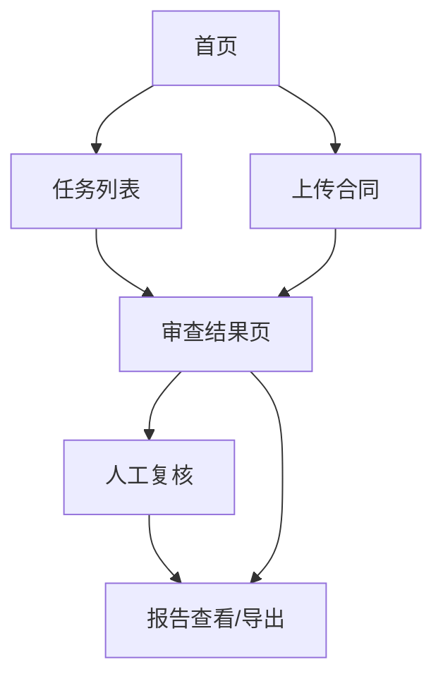

# 财务合规审查 MVP UI 线框与页面信息架构

更新时间：2026-05-28

## 1. UI 目标

这个 MVP 的 UI 不是聊天机器人，而是一个**审查工作台**。

要达成 4 个目标：

1. 看起来像一个能交付的产品，而不是技术 demo
2. 能直观看到“合同 -> 风险 -> 依据 -> 结论”的链路
3. 桌面端适合演示，手机端可以正常浏览和复核
4. 页面结构足够简单，方便你快速开发

## 2. 产品形态结论

MVP 推荐形态：

- `Web 网站`
- `响应式布局`
- `桌面优先设计`
- `手机端可查看、可复核、可导出`

不推荐形态：

- 纯聊天窗口
- 只有 API 页面
- 只有后台表格页
- 复杂多级菜单系统

## 3. 页面清单

MVP 只做 5 个页面：

1. `首页 / Landing`
2. `任务列表页`
3. `合同上传页`
4. `审查结果页`
5. `人工复核 / 报告页`

其中真正必须完成的是后 4 个。

## 4. 信息架构



### 4.1 导航结构

顶部导航只保留：

- `工作台`
- `上传合同`
- `样本数据`
- `关于系统`

左侧不做复杂菜单。

### 4.2 用户主路径

用户最核心的使用路径只有一条：

`进入工作台 -> 上传合同 -> 等待任务完成 -> 查看风险和依据 -> 人工复核 -> 导出报告`

## 5. 页面视觉方向

### 5.1 风格定位

建议做成：

- `审查中枢`
- `风险控制台`
- `清晰、锐利、可信`

不要做成：

- 通用 SAAS 蓝白后台
- 紫色 AI 聊天产品
- 法务风“全是文字的文档页”

### 5.2 色彩建议

```css
:root {
  --bg: #f4f1e8;
  --surface: #fffaf0;
  --ink: #1e2430;
  --muted: #6a7282;
  --line: #d9d1c2;
  --brand: #1f4d3a;
  --brand-2: #c98b2f;
  --risk-red: #b33a2b;
  --risk-yellow: #c28a1b;
  --risk-green: #2f7d58;
  --accent: #2447d5;
}
```

视觉含义：

- 主背景偏纸感，不是纯白
- 风险色明确
- 品牌色用深绿和铜金，避免“默认 AI 产品感”

### 5.3 字体建议

中文建议：

- 标题：`Noto Serif SC` 或 `Source Han Serif SC`
- 正文：`Noto Sans SC` 或 `Source Han Sans SC`
- 数字与编号：`IBM Plex Sans`

## 6. 页面一：首页 / Landing

### 6.1 目标

首页只做 3 件事：

1. 说明这是“合同合规审查工作台”
2. 让用户进入上传或工作台
3. 通过视觉快速建立产品感

### 6.2 桌面线框

```text
+----------------------------------------------------------------------------------+
| LOGO            合同合规审查工作台                        工作台  上传合同  关于  |
+----------------------------------------------------------------------------------+
|                                                                                  |
|    合同风险在上传后 1 分钟内变成可复核清单                                        |
|    自动抽取关键字段 · 命中制度规则 · 输出风险依据 · 支持人工复核                    |
|                                                                                  |
|    [立即上传合同]     [查看演示样本]                                              |
|                                                                                  |
|    ┌───────────────┬───────────────┬───────────────┐                             |
|    │ 结构化抽取     │ 规则命中       │ 报告导出       │                             |
|    │ 30+ 字段       │ 红黄绿分级     │ HTML/PDF      │                             |
|    └───────────────┴───────────────┴───────────────┘                             |
|                                                                                  |
|    [右侧大图：三栏审查工作台预览图]                                               |
|                                                                                  |
+----------------------------------------------------------------------------------+
```

### 6.3 手机线框

```text
+----------------------------------+
| LOGO                    菜单     |
+----------------------------------+
| 合同风险在上传后变成可复核清单    |
| 自动抽取 · 规则命中 · 报告导出    |
| [立即上传合同]                    |
| [查看演示样本]                    |
|                                  |
| [结构化抽取]                      |
| [规则命中]                        |
| [报告导出]                        |
+----------------------------------+
```

### 6.4 核心元素

- Hero 标题
- 2 个按钮
- 3 个能力卡片
- 1 张系统预览图

## 7. 页面二：任务列表页

### 7.1 目标

这是实际工作入口。必须让用户一进来就知道：

- 现在有多少任务
- 哪些待复核
- 哪些高风险
- 点哪里进入处理

### 7.2 桌面线框

```text
+----------------------------------------------------------------------------------+
| 合同合规审查工作台         [上传合同]      搜索框                                 |
+----------------------------------------------------------------------------------+
| 风险摘要卡片                                                                      |
| [全部任务 18]   [待复核 4]   [高风险 3]   [今日新增 5]                            |
+----------------------------------------------------------------------------------+
| 筛选： 合同类型▼   风险等级▼   任务状态▼   日期▼                                  |
+----------------------------------------------------------------------------------+
| 任务编号   合同名称                 类型      风险   状态          创建时间   操作   |
| rv001    营销系统开发服务合同       服务合同   红     待复核         10:22    查看   |
| rv002    网络设备采购合同           采购合同   绿     已完成         10:10    查看   |
| rv003    办公耗材框架采购合同       采购合同   红     待复核         09:45    查看   |
+----------------------------------------------------------------------------------+
```

### 7.3 手机线框

```text
+----------------------------------+
| 工作台            [上传]          |
+----------------------------------+
| 全部18  待复核4  高风险3          |
| 筛选：类型▼ 风险▼ 状态▼          |
+----------------------------------+
| rv001                             |
| 营销系统开发服务合同               |
| 服务合同 · 红 · 待复核             |
| [查看详情]                        |
+----------------------------------+
| rv002                             |
| 网络设备采购合同                   |
| 采购合同 · 绿 · 已完成             |
| [查看详情]                        |
+----------------------------------+
```

### 7.4 信息优先级

1. 风险等级
2. 任务状态
3. 合同名称
4. 合同类型
5. 创建时间

## 8. 页面三：上传合同页

### 8.1 目标

必须让用户感觉“上传完就会开始跑”，不能像传统后台表单。

### 8.2 桌面线框

```text
+----------------------------------------------------------------------------------+
| 上传合同                                                                         |
+----------------------------------------------------------------------------------+
| 左侧：上传区                         | 右侧：说明区                               |
| ┌──────────────────────────────┐    | 支持 PDF / DOCX                            |
| │ 拖拽文件到此处                 │    | 自动完成条款拆分、字段抽取、规则检查         |
| │ 或 [选择文件]                  │    | 推荐先使用演示样本                         |
| └──────────────────────────────┘    |                                           |
|                                      | 示例流程：                                 |
| 合同类型： [服务合同▼]               | 上传 -> 解析 -> 抽取 -> 检索 -> 判定         |
| 业务线：   [信息化服务▼]             |                                           |
| 相对方：   [________________]         |                                           |
| 备注：     [________________]         |                                           |
|                                      |                                           |
| [开始审查]                           |                                           |
+----------------------------------------------------------------------------------+
```

### 8.3 上传后状态

上传后不要跳空白页，直接展示任务进度：

```text
[任务已创建]
状态：parsing -> extracting -> retrieving -> evaluating
当前进度：条款解析中...
预计耗时：30-60 秒
```

### 8.4 手机线框

```text
+----------------------------------+
| 上传合同                          |
+----------------------------------+
| [选择文件]                        |
| 合同类型 [服务合同▼]              |
| 业务线   [信息化服务▼]            |
| 相对方   [____________]           |
| 备注     [____________]           |
| [开始审查]                        |
+----------------------------------+
| 任务状态：extracting              |
| 当前进度：字段抽取中              |
+----------------------------------+
```

## 9. 页面四：审查结果页

### 9.1 目标

这是 MVP 最核心、最吸引人的页面。

必须完成 3 件事：

1. 看见风险
2. 看见证据
3. 看见依据

### 9.2 桌面布局结论

桌面端必须用三栏布局：

- 左栏：条款目录
- 中栏：合同原文
- 右栏：风险详情

### 9.3 桌面线框

```text
+------------------------------------------------------------------------------------------------------+
| 合同名称：营销系统开发服务合同       总体风险：红       命中规则：4      待复核：2     [导出报告]    |
+------------------------------------------------------------------------------------------------------+
| 左栏：条款目录              | 中栏：合同原文与高亮                | 右栏：风险卡片                   |
| C001 合同双方               | [C006] 合同签署后5日内支付50%预付款 | [FIN-SVC-004] 红                 |
| C002 服务内容               | [高亮红色]                          | 预付款比例超过30%                |
| C003 服务期限               |                                      | 依据：POLICY-FUND-003           |
| C004 合同金额               | [C007] 10日内无异议视为验收通过      | 证据：C006 C007                 |
| C005 发票安排               | [高亮黄色]                          | [查看依据] [加入复核]           |
| C006 付款安排               |                                      |----------------------------------|
| C007 验收安排               |                                      | [FIN-SVC-006] 红                 |
| C008 违约责任               |                                      | 自动续约无审批前提               |
| ...                         |                                      | ...                              |
+------------------------------------------------------------------------------------------------------+
| 下方：字段抽取结果表格                                                                           |
| payment.prepay_ratio = 50   invoice.tax_rate = missing   dispute.location = 乙方所在地仲裁        |
+------------------------------------------------------------------------------------------------------+
```

### 9.4 右栏风险卡片结构

每张卡片固定包含：

- 风险级别
- 规则编号
- 风险说明
- 合同证据条款
- 制度依据编号
- 修改建议
- 操作按钮

### 9.5 中栏交互

中栏必须支持：

- 点击左栏条款目录定位到原文
- 点击右栏风险项高亮对应条款
- hover 或点击证据编号，定位到条款

### 9.6 手机布局

手机端不能保留三栏，改成分页式：

1. 顶部摘要卡片
2. 风险卡片列表
3. 条款原文折叠区
4. 字段抽取结果折叠区

手机线框：

```text
+----------------------------------+
| 营销系统开发服务合同      红      |
| 命中规则4  待复核2  [导出]        |
+----------------------------------+
| [风险卡1]                         |
| FIN-SVC-004                       |
| 预付款比例超过30%                 |
| 证据：C006 C007                   |
| 依据：POLICY-FUND-003            |
| [查看条款] [加入复核]             |
+----------------------------------+
| [风险卡2]                         |
+----------------------------------+
| 合同条款（折叠）                  |
| 字段抽取（折叠）                  |
+----------------------------------+
```

## 10. 页面五：人工复核 / 报告页

### 10.1 目标

让人感觉这不是“一次性 AI 输出”，而是能人工接管。

### 10.2 桌面线框

```text
+----------------------------------------------------------------------------------+
| 人工复核                                                                         |
+----------------------------------------------------------------------------------+
| 左侧：待复核风险列表                  | 右侧：复核面板                           |
| [FIN-SVC-004] 红                      | 风险等级： [红▼]                         |
| [FIN-SVC-006] 红                      | 处理结论： [需修改▼]                     |
| [FIN-SVC-002] 黄                      | 复核说明：                               |
|                                       | [____________________________________]   |
|                                       | [____________________________________]   |
|                                       |                                           |
|                                       | [提交当前复核]                            |
|                                       | [生成最终报告]                            |
+----------------------------------------------------------------------------------+
```

### 10.3 手机线框

```text
+----------------------------------+
| 人工复核                          |
+----------------------------------+
| 风险：FIN-SVC-004                |
| 风险等级 [红▼]                    |
| 处理结论 [需修改▼]                |
| 复核说明                          |
| [__________________________]      |
| [提交复核]                        |
+----------------------------------+
```

### 10.4 报告页展示结构

报告页建议和导出内容一致：

1. 总体结论
2. 风险摘要
3. 逐条风险
4. 合同证据
5. 制度依据
6. 复核结论

## 11. 桌面端与手机端适配策略

### 11.1 响应式断点

建议：

- `>= 1280px`：宽屏桌面
- `>= 1024px`：普通桌面
- `>= 768px`：平板
- `< 768px`：手机

### 11.2 布局变化

| 页面 | 桌面 | 手机 |
|---|---|---|
| 首页 | Hero + 功能卡 + 大预览图 | Hero + 按钮 + 卡片堆叠 |
| 任务列表 | 表格 | 卡片列表 |
| 上传页 | 双栏 | 单栏 |
| 结果页 | 三栏 | 摘要 + 风险卡 + 折叠区 |
| 复核页 | 左右双栏 | 单栏表单 |

### 11.3 手机端必须保留的能力

- 查看任务状态
- 查看风险项
- 查看证据编号
- 提交人工复核
- 导出报告

## 12. 组件清单

MVP 组件只做这些：

- 顶部导航栏
- 风险摘要卡片
- 文件上传框
- 状态进度条
- 条款目录树
- 风险卡片
- 字段表格
- 依据引用面板
- 复核表单
- 报告区块

## 13. 页面状态设计

每个核心页面至少要考虑下面状态：

### 13.1 上传页

- 初始
- 上传中
- 创建任务成功
- 上传失败

### 13.2 结果页

- 处理中
- 成功有结果
- 成功但无风险
- 失败

### 13.3 复核页

- 待复核
- 已保存未提交
- 已提交

## 14. 最终 UI 决策

如果只能记住一件事，就记住这句：

**MVP 不做聊天机器人，做“三栏审查工作台 + 手机可复核”的响应式网站。**

## 15. 开发顺序建议

前端页面实现顺序固定为：

1. `任务列表页`
2. `上传页`
3. `审查结果页`
4. `人工复核页`
5. `首页`

原因：

- 先做工作流主链路
- 再做展示层最核心页面
- 首页最后补，不影响主功能
