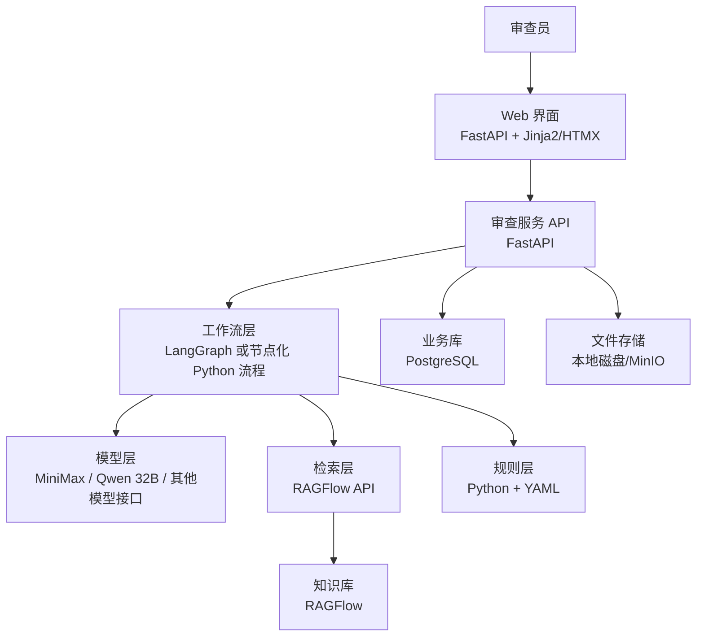
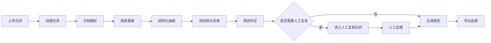
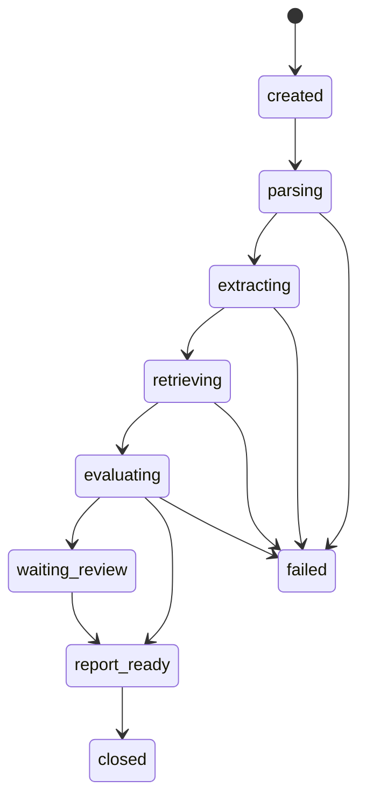
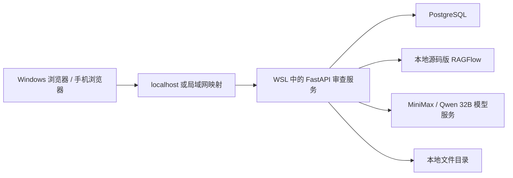

# 财务/合同合规审查技术方案与 MVP 计划执行版

更新时间：2026-05-27

## 1. MVP 目标与范围

### 1.1 本期只做的业务功能

MVP 只做下面这一条业务链：

`上传合同 -> 自动解析 -> 自动抽取关键字段 -> 自动匹配制度依据 -> 自动跑规则 -> 生成人工复核清单 -> 生成审查报告`

首期范围固定为：

- 合同类型：`采购合同`、`服务合同`
- 规则数量：`20` 条左右
- 抽取字段：`30` 个左右
- 用户角色：`审查员`
- 输出结果：`风险列表`、`证据定位`、`审查报告`

### 1.2 MVP 交付结果

交付时用户必须能看到这 5 个结果：

1. 上传一份 PDF/Word 合同后，系统能生成一条审查任务
2. 任务完成后能看到合同的关键字段抽取结果
3. 能看到每条风险对应的合同原文证据和制度依据
4. 能人工修改风险级别、写复核意见、提交结论
5. 能导出一份审查报告

### 1.3 MVP 不做的内容

本期明确不做：

- 自由问答机器人
- 多轮智能对话助手
- 多部门复杂审批流
- 本地大模型部署
- 供应商外部黑名单联查
- BI 大屏

## 2. 技术和软件组件分层

### 2.1 总体分层



### 2.2 组件选型

| 层     | 组件       | 软件/技术                                | 作用                  | MVP 选型理由           |
| ----- | -------- | ------------------------------------ | ------------------- | ------------------ |
| 展示层   | 审查界面     | `FastAPI + Jinja2 + HTMX + Tailwind` | 上传、任务列表、结果页、复核页     | 单人开发最快，不拆前后端       |
| API 层 | 业务接口     | `FastAPI`                            | 任务、报告、复核、规则接口       | Python 生态一致        |
| 工作流层  | 审查流程     | `LangGraph` 或节点化 Python 服务           | 解析、抽取、检索、规则、复核、报告串联 | 先按节点写，后续可平滑强化      |
| 模型层   | 结构化抽取/解释 | `LLM Gateway（MiniMax / Qwen 32B / 其他兼容接口）` | 字段抽取、条款解释、报告文本生成    | 不绑定单一厂商，优先复用现有私有化部署 |
| 知识层   | 检索与引用    | `RAGFlow`                            | 制度库、模板库、案例库、引用依据    | 你已有经验，直接复用，优先接入 WSL 中现有源码版实例 |
| 规则层   | 确定性判断    | `Python + YAML`                      | 红黄绿判定、阈值判断、人工升级     | 足够快，易维护            |
| 存储层   | 业务数据     | `PostgreSQL`                         | 任务、字段、风险、复核、审计      | 查询和结构化记录方便         |
| 文件层   | 原文存储     | `本地磁盘` 或 `MinIO`                     | 原合同、报告、导出文件         | MVP 不额外引入复杂度       |

当前运行形态先固定为：`Windows 浏览器/手机浏览器 -> WSL 中的审查服务 -> 本地命令方式启动的 RAGFlow -> 现有 MiniMax/Qwen 接口`。云服务器暂不承担 MVP 主链路，只保留历史服务。

### 2.3 目录结构建议

```text
review-app/
  app/
    api/
      review.py
      report.py
      admin.py
    services/
      parser_service.py
      ragflow_service.py
      llm_service.py
      rule_service.py
      report_service.py
    workflows/
      review_graph.py
      states.py
      nodes.py
    models/
      task.py
      extraction.py
      rule_hit.py
      review_note.py
    rules/
      procurement/
      service/
    prompts/
      extraction/
      explanation/
      report/
    templates/
      task_list.html
      upload.html
      result.html
      review.html
    static/
  data/
    uploads/
    exports/
  scripts/
    init_db.py
    import_rules.py
    eval_run.py
  tests/
```

### 2.4 为什么不做成纯模型方案，LangGraph 是否必需

先把结论说清楚：

1. **方案不应该绑定在单一模型厂商上，而应该做成“模型接入层 + 可替换主模型”的结构。**
2. **既然你已经有私有化 `MiniMax` 和 `Qwen 32B`，MVP 应优先复用现有模型能力，而不是再额外依赖单一外部模型。**
3. **MVP 阶段不建议做成“纯模型 + RAG 问答/Agent”方案。**
4. **`LangGraph` 对 MVP 不是必需，对试点版和正式版很有必要。**

#### 2.4.1 模型实际采用在什么位置

本方案里，模型层负责 4 件明确的事：

- 条款级字段抽取
- 合同级字段归并和冲突识别
- 模糊条款解释
- 报告中建议文本的整理

也就是说，本方案不是“模型不用”，而是：

`模型负责理解和抽取，RAGFlow 负责给依据，规则层负责裁决，人工复核负责最终覆盖。`

#### 2.4.2 为什么不采用“纯模型方式”

如果这里的“纯模型方式”指的是：

- `MiniMax/Qwen + Prompt`
- 或 `MiniMax/Qwen + RAG`
- 或 `MiniMax/Qwen + RAG + Tool Calling`
- 或 “一个大模型 + 一个大 Prompt + 一个 Chat UI”

那么这类方案可以做演示，但不适合作为财务合规审查 MVP 的主架构，原因是下面这 6 条。

##### 原因 1：模型能解释，不等于系统能裁决

财务合规审查最终要输出的是：

- 是否命中规则
- 命中哪条制度
- 依据哪段合同
- 是否必须人工复核
- 是否允许放行

这些结果要求稳定、可重复、可追溯。

纯模型方案的典型问题是：

- 这次回答说高风险，下次回答说中风险
- 这次引用第 4.2 条，下次引用第 4.3 条
- 输出像顾问意见，不像审查结论

所以模型可以参与判断，但不能独自承担最终裁决逻辑。

##### 原因 2：财务审查里有大量硬规则，不适合只靠模型

例如：

- 预付款比例大于 30%
- 付款早于验收
- 缺失发票条款
- 自动续约但没有审批前提
- 收款账户名与合同相对方不一致

这类检查本质上是“字段 + 阈值 + 条件”的确定性判断。

如果交给模型自由推理，会出现两个问题：

- 判断口径不稳定
- 难以做批量回归测试

所以这部分应该固定在规则层，而不是交给模型自由生成。

##### 原因 3：企业更需要证据链，不需要开放式探索

DeepResearch/Agent 式方案适合做：

- 制度梳理
- 特殊条款研究
- 复杂跨文档分析

但财务审查主流程更需要的是：

- 固定输入
- 固定步骤
- 固定输出
- 固定证据

企业在正式使用时不会优先关心“模型思考得多聪明”，而会关心：

- 为什么判这条风险
- 哪条制度支持这个结论
- 谁改过结论
- 模型和规则版本是什么

纯模型方案在这些点上天然不如“结构化抽取 + 规则 + 审计留痕”稳。

##### 原因 4：人工复核不能只是聊天补丁

财务合规场景里，人工复核不是“问一句模型再看看”，而是一个正式节点。

这个节点要支持：

- 看证据
- 改风险级别
- 写复核说明
- 留责任人和时间

如果流程只是“模型 + Chat UI”，人工操作难以沉淀成正式的业务记录。

##### 原因 5：没有结构化结果，后面就没法统计和复盘

后续一定会有这类需求：

- 哪类合同最容易出问题
- 哪条规则命中最多
- 哪些字段抽取经常出错
- 人工最常改哪类风险

这要求结果从一开始就是结构化的。

纯模型输出长文本，即使读起来像报告，也不利于后续统计、优化和回归。

##### 原因 6：MVP 要求的是稳定交付，不是最高自由度

你现在要的是：

- 在短周期内完成可用 MVP
- 业务方能马上看见可操作页面
- 审查结果能对上制度和合同原文

在这个目标下，最短路径不是“把模型自由度放大”，而是把系统约束收紧。

#### 2.4.3 结合你现有 MiniMax / Qwen 32B 的判断

你现在已经有两个私有化模型资源：

- `MiniMax`
- `Qwen 32B`

这会直接影响方案选择：

1. **优先做模型无关接入层，不再把代码写成某一家专用实现。**
2. **优先把私有化模型放到生产链路，减少额外外部依赖和数据外发。**
3. **主模型不靠拍脑袋选，而是用你自己的合同样本做 A/B 评测。**

推荐的工程做法是：

- 对外统一一个 `llm_service.py`
- 内部支持 `provider=minimax`、`provider=qwen32b`
- 每个任务记录本次使用的 `provider/model/version`
- 抽取、解释、报告三个节点允许配置不同模型

#### 2.4.4 MiniMax / Qwen 32B 在本项目中的建议分工

在不假设具体版本能力细节的前提下，建议先按下面方式落地：

##### 方案 A：单主模型最简路线

- `Qwen 32B` 做字段抽取、条款分类、报告生成
- `MiniMax` 先作为备用模型，不进主链路

这个方案最适合：

- 你希望最快做出 MVP
- 先减少变量
- 先把规则链路跑顺

##### 方案 B：双模型分工路线

- `Qwen 32B`：条款级抽取、合同级归并、结构化 JSON 输出
- `MiniMax`：模糊条款解释、复核辅助说明、报告润色

这个方案最适合：

- 你发现一个模型抽取更稳，另一个模型生成表达更好
- 你希望在不增加太多复杂度的前提下做能力分层

##### 方案 C：A/B 评测后再定主模型

对 20 到 30 份样本合同，同时跑：

- `MiniMax`
- `Qwen 32B`

对比 4 组指标：

1. 关键字段抽取准确率
2. JSON 输出稳定性
3. 风险解释可用性
4. 单份合同推理耗时

然后再决定：

- 哪个模型做主抽取
- 哪个模型做解释辅助
- 是否需要双模型分工

对你现在的情况，我更推荐 **方案 C**，其次是 **方案 A**。

#### 2.4.5 三种实现方式的判断

| 方案 | 组成 | 是否推荐 | 判断 |
|---|---|---|---|
| 纯模型方案 | `MiniMax/Qwen + Prompt + RAG` | 不推荐做主方案 | 演示快，但不稳定，证据链和规则裁决不够硬 |
| 模型混合方案 | `MiniMax/Qwen + RAGFlow + Python 规则层` | **推荐做 MVP** | 开发快，结构清楚，风险可控 |
| 正式版方案 | `MiniMax/Qwen + RAGFlow + 规则层 + LangGraph` | **推荐做试点/正式版** | 适合状态管理、人工复核、异常分支和留痕 |

#### 2.4.6 如果坚持走“更依赖模型的方式”，最合理的边界是什么

如果一定要尽量提高模型参与度，建议把它限定在模型能力层，而不是整条业务主流程。

建议的使用边界如下：

- 模型负责字段抽取
- 模型负责条款解释
- 模型负责冲突归并和报告润色
- 不让模型直接决定最终是否放行
- 不让模型直接替代规则引擎
- 不让模型自由决定整条流程走向

换句话说，可以**大量使用你现有的 `MiniMax / Qwen 32B`，但不能把整个系统退化成“一个大 Prompt + 一个大模型”**。

#### 2.4.7 那这样还需要 `LangGraph` 吗

答案分两个阶段。

##### 阶段 A：MVP 阶段

**不一定需要。**

如果 MVP 只做下面这条固定同步链路：

`上传 -> 解析 -> 抽取 -> 检索 -> 规则 -> 报告`

并且满足下面条件：

- 合同类型只有 1 到 2 类
- 审查员角色单一
- 人工复核流程很简单
- 不需要复杂暂停/恢复
- 不需要很多异常分支

那么完全可以先不用 `LangGraph`，直接用普通 Python 节点编排就够了。

MVP 阶段更推荐这样写：

```python
def run_review(task_id: str):
    parse_result = parse_contract(task_id)
    extract_result = extract_fields(parse_result)
    retrieval_result = retrieve_policy(extract_result)
    rule_result = evaluate_rules(extract_result, retrieval_result)

    if need_manual_review(extract_result, rule_result):
        mark_waiting_review(task_id, extract_result, rule_result)
        return

    report = build_report(task_id, extract_result, rule_result)
    finish_task(task_id, report)
```

这种写法对 MVP 足够，而且更快。

##### 阶段 B：试点版和正式版

**建议要。**

当出现下面这些情况时，`LangGraph` 就很有价值：

1. 一个任务会走多个状态节点
2. 任务需要暂停，等待人工复核后恢复
3. 不同合同类型要走不同分支
4. 节点失败后需要重试和断点续跑
5. 需要记录每一步的输入、输出、版本和状态
6. 后续要扩展到付款审批、发票审核、供应商准入

这时候 `LangGraph` 的价值不是“更智能”，而是：

- 状态持久化
- 节点编排
- 分支控制
- 人工中断恢复
- 审计追踪

也就是说，`LangGraph` 解决的是**流程工程问题**，不是模型能力问题。

#### 2.4.8 最终判断

最终建议固定为下面这条：

- **MVP**：`MiniMax/Qwen 32B + RAGFlow + Python 规则层 + 普通节点编排`
- **试点/正式版**：`MiniMax/Qwen 32B + RAGFlow + Python 规则层 + LangGraph`

再压缩成一句话就是：

**本方案不是排斥模型，而是不做成“纯模型架构”；你现有的 `MiniMax / Qwen 32B` 应优先复用，LangGraph 不是第一天必须上，但当流程进入正式业务化阶段时，建议补上。**

### 2.5 GitHub 上现在可参考且能直接看到效果的项目

这一部分只列两类项目：

1. **能直接看到产品效果的项目**
2. **虽然不是合同审查产品，但很适合借鉴界面和工作流的项目**

不列纯论文仓库，也不列只有脚本没有界面的仓库。

#### 2.5.1 最值得看的 7 个项目

| 项目                    | 地址                                                   | 能看到什么效果                                                 | 最适合借鉴什么                         | 是否适合直接照搬                     |
| --------------------- | ---------------------------------------------------- | ------------------------------------------------------- | ------------------------------- | ---------------------------- |
| `OpenContracts`       | <https://github.com/Open-Source-Legal/OpenContracts> | 仓库里有 `See it in Action`，有 PDF annotation flow 和 demo 站点 | 合同原文标注、证据定位、人工审阅协作、PDF 与结构化结果联动 | 不适合直接照搬整套，适合借鉴审查工作台形态        |
| `RAGFlow`             | <https://github.com/infiniflow/ragflow>              | 有完整 Web UI、知识库、分块可视化、引用追溯、Cloud 版本可体验                   | 知识库管理、文档解析、引用展示、多数据集检索          | 适合直接借鉴知识库层，不适合替代完整审查工作台      |
| `LawBotics`           | <https://github.com/hasnaintypes/lawbotics>          | 仓库指向 `lawbotics.vercel.app`，定位就是合同上传、分析、条款抽取、结果查看       | 合同分析产品页、字段/条款结果页、法律场景表达方式       | 可借鉴页面和功能命名，不建议作为企业架构底座       |
| `Legal Guard RegTech` | <https://github.com/nathangtg/legal-guard-regtech>   | README 里有 Demo Video、Swagger UI、前端页面说明、分析接口清单           | 合规中心、风险评分页、API 结构、报告输出方式        | 适合作为“合规检查平台”原型参考，不适合直接上生产    |
| `Dify`                | <https://github.com/langgenius/dify>                 | 有可视化 Workflow Canvas、RAG Pipeline、模型管理和观测界面             | 工作流画布、节点编排界面、低代码配置体验            | 适合借鉴流程配置形态，不是合同审查专用产品        |
| `AnythingLLM`         | <https://github.com/Mintplex-Labs/anything-llm>      | 桌面版和 Docker 版都有成型 UI，文档上传、工作区、Agent Builder 很完整         | 文档上传体验、工作区、用户侧问答入口、轻量交互         | 适合借鉴普通用户入口，不适合做审查裁决核心        |
| `Danswer / Onyx`      | <https://github.com/ocean-oo/danswer>                | README 里直接带 Web UI Demo 和 Slack Demo 视频                 | 引用式问答、来源回链、企业搜索入口、连接器后台         | 适合借鉴“带引用的检索问答”体验，不是合同审查工作流系统 |

#### 2.5.2 如果你的目标是“看起来像一个能用的产品”，优先看什么

优先顺序建议如下：

1. **先看 `OpenContracts`**
2. **再看 `RAGFlow`**
3. **再看 `LawBotics`**
4. **最后看 `Dify` 和 `AnythingLLM`**

原因很直接：

- `OpenContracts` 最接近“文档审查工作台”本身
- `RAGFlow` 最接近“知识库和引用底座”
- `LawBotics` 最接近“合同 AI 产品页面效果”
- `Dify` 最接近“可视化流程编排后台”
- `AnythingLLM` 最接近“普通用户文档交互入口”

#### 2.5.3 针对你这个项目，分别该看这些项目的哪一部分

##### A. 想看“结果页和审查工作台”长什么样

优先看：

- `OpenContracts`
- `LawBotics`

重点看：

- 左侧文档目录
- 中间原文定位
- 右侧抽取结果/风险项
- 审查员如何点开证据

##### B. 想看“知识库和引用展示”长什么样

优先看：

- `RAGFlow`
- `Danswer / Onyx`

重点看：

- 多知识库组织
- 检索结果引用
- 来源跳转
- 文档上传和索引状态

##### C. 想看“流程后台和节点编排”长什么样

优先看：

- `Dify`

重点看：

- 节点画布
- Prompt/Model 配置区
- 检索节点
- 条件分支
- 调试和运行日志

##### D. 想看“普通用户上传后立刻能看到什么”长什么样

优先看：

- `AnythingLLM`
- `LawBotics`

重点看：

- 上传入口
- 工作区列表
- 任务结果摘要
- 文档问答入口

#### 2.5.4 这些项目里，哪些最适合你现在直接参考

如果目标是这次就做出 MVP，建议只重点看 4 个：

1. `RAGFlow`
2. `OpenContracts`
3. `LawBotics`
4. `Dify`

对应关系如下：

| 你的模块 | 最应该参考的项目 |
|---|---|
| 知识库上传、解析、引用 | `RAGFlow` |
| 审查结果页、证据高亮、审阅工作台 | `OpenContracts` |
| 上传页、结果页、合同 AI 产品化表达 | `LawBotics` |
| 后台流程编排和节点配置体验 | `Dify` |

#### 2.5.5 不建议你把时间花太多的项目类型

下面这类项目可以看看，但不建议作为这次主参考：

- 只有 Notebook 的 agent 演示项目
- 只有论文复现、没有完整前后台的仓库
- Hackathon 风格但没有任务、证据、复核闭环的项目
- 只有聊天界面、没有规则和证据页的项目

原因很简单：

- 对演示有帮助
- 对真正做审查系统帮助有限

#### 2.5.6 最终建议

如果你这两天就要快速获得“页面和产品感”的参考顺序，直接按这个顺序看：

1. `OpenContracts`
2. `RAGFlow`
3. `LawBotics`
4. `Dify`
5. `AnythingLLM`

如果你只想看最小集合，只看这 3 个就够：

1. `RAGFlow`
2. `OpenContracts`
3. `Dify`

## 3. 工作原理和核心方法

### 3.1 核心原则

系统不是“先问模型，再看它怎么回答”，而是固定走 6 个步骤：

1. `解析`：把合同拆成条款、表格、页码、段落
2. `抽取`：把文本转成结构化字段
3. `检索`：从制度/模板/案例库里找相关依据
4. `判定`：用规则把字段和依据转成风险项
5. `复核`：低置信度或高风险项进入人工确认
6. `报告`：输出最终审查结果

### 3.2 文档解析方法

#### 输入

- PDF
- DOCX
- 扫描件 PDF

#### 处理方法

1. 调用 `RAGFlow` 做文档解析和分块
2. 按合同标题、章节号、条款号重建条款层级
3. 为每个条款生成唯一 `clause_id`
4. 保存条款文本、页码、块序号、原文位置

#### 输出

- 合同基础信息
- 条款列表
- 表格文本
- 原文定位信息

条款结构建议固定成这样：

```json
{
  "clause_id": "c_014",
  "title": "付款方式",
  "page_no": 6,
  "section_no": "4.2",
  "text": "甲方在收到乙方发票后15个工作日内支付合同总价的50%作为预付款……",
  "bbox": null
}
```

### 3.3 结构化抽取方法

抽取不要一次性让模型输出整份报告，而是分两轮。

#### 第一轮：条款级抽取

目标是从局部条款抽出字段和值。

抽取内容：

- 金额
- 税率
- 发票类型
- 付款节点
- 验收条件
- 自动续约
- 解约条件
- 争议解决方式
- 违约责任
- 收款账户

#### 第二轮：合同级归并

目标是把多个条款中的局部结果归并成最终字段，并处理冲突。

归并规则：

- 同字段多个候选值时，保留置信度最高项
- 候选值冲突时打 `need_review=true`
- 关键字段无值时记为 `missing`

抽取输出建议：

```json
{
  "contract_type": "service_contract",
  "fields": {
    "counterparty_name": {
      "value": "上海某某科技有限公司",
      "confidence": 0.97,
      "evidence_clause_ids": ["c_002"]
    },
    "payment.prepay_ratio": {
      "value": 50,
      "confidence": 0.92,
      "evidence_clause_ids": ["c_014"]
    },
    "invoice.type": {
      "value": "增值税专用发票",
      "confidence": 0.88,
      "evidence_clause_ids": ["c_015"]
    }
  },
  "missing_fields": ["invoice.tax_rate"],
  "review_flags": [
    {
      "field": "termination.right",
      "reason": "第8条与第12条存在冲突"
    }
  ]
}
```

### 3.4 检索方法

检索不是泛搜全库，而是按业务对象分库检索。

知识库分成 4 类：

- `policy_finance`：财务制度
- `policy_procurement`：采购制度
- `contract_template`：标准模板条款
- `review_case`：历史审查案例

检索输入由三部分组成：

1. 合同类型
2. 命中规则或待判定字段
3. 对应条款原文

检索策略：

- 对每条待判定规则单独检索，不做整份合同一次性检索
- 每类知识库取 `top_k=3`
- 返回结果只保留带引用片段的数据

检索请求示例：

```json
{
  "kb_ids": ["policy_finance", "contract_template"],
  "query": "服务合同 预付款比例 50% 验收后付款 发票条款",
  "filters": {
    "contract_type": "service_contract"
  },
  "top_k": 3
}
```

### 3.5 规则判定方法

规则层只做确定性判断，不输出长篇文字。

每条规则由 6 部分组成：

1. `scope`：适用合同类型
2. `when`：判断条件
3. `severity`：风险级别
4. `message`：风险说明
5. `required_evidence`：需要绑定哪些字段或条款
6. `action`：自动通过、提示、人工复核

规则示例：

```yaml
rule_id: FIN-SVC-004
name: 服务合同预付款比例超阈值
scope:
  - service_contract
severity: high
when:
  all:
    - field: payment.prepay_ratio
      op: ">"
      value: 30
    - field: acceptance.required
      op: "=="
      value: true
message: "预付款比例超过30%，且合同以验收作为付款前提"
required_evidence:
  - payment.prepay_ratio
  - acceptance.required
action: manual_review
```

规则执行结果：

```json
{
  "rule_id": "FIN-SVC-004",
  "risk_level": "red",
  "hit": true,
  "message": "预付款比例超过30%，且合同以验收作为付款前提",
  "contract_evidence": [
    {"clause_id": "c_014", "text": "甲方应支付50%预付款"}
  ],
  "policy_evidence": [
    {"doc_name": "财务付款管理制度", "chunk_id": "kb_332"}
  ],
  "action": "manual_review"
}
```

### 3.6 人工复核方法

下面 4 类情况直接进人工复核：

1. 抽取字段置信度低于 `0.80`
2. 同一字段出现冲突值
3. 规则命中 `action=manual_review`
4. 合同金额或主体命中人工升级条件

人工复核时可执行的动作只有 4 个：

- 通过
- 驳回
- 修改风险级别
- 补充复核说明

### 3.7 报告生成方法

报告不让模型自由写，而是模板生成。

报告固定包含：

1. 合同摘要
2. 关键字段
3. 命中风险
4. 风险依据
5. 修改建议
6. 复核结论

报告生成顺序：

1. 先拼结构化结果
2. 再把每条风险的证据和依据填进去
3. 最后只让模型润色“建议描述”和“结论描述”

### 3.8 核心执行伪代码

```python
def review_contract(task_id: str, file_path: str):
    parsed_doc = parser_service.parse(file_path)
    clauses = parser_service.build_clauses(parsed_doc)

    extraction = llm_service.extract_contract_fields(clauses)
    retrieval_bundle = ragflow_service.retrieve_for_rules(
        contract_type=extraction["contract_type"],
        fields=extraction["fields"],
        clauses=clauses,
    )

    rule_hits = rule_service.evaluate(
        contract_type=extraction["contract_type"],
        fields=extraction["fields"],
        retrieval_bundle=retrieval_bundle,
    )

    if should_manual_review(extraction, rule_hits):
        return create_manual_review_task(task_id, clauses, extraction, rule_hits)

    report = report_service.generate(task_id, clauses, extraction, rule_hits)
    return finalize_task(task_id, report)
```

## 4. 工作流程

### 4.1 自动审查主流程



### 4.2 任务状态机



### 4.3 人工复核流程

1. 审查员打开任务详情页
2. 查看风险列表
3. 点击某条风险，右侧显示合同原文证据和制度依据
4. 如果认同系统判断，直接通过
5. 如果不同意，修改风险级别并填写说明
6. 提交复核结论
7. 系统生成最终报告并记录操作日志

## 5. 数据结构与接口

### 5.1 审查任务结构

```json
{
  "task_id": "rv_20260527_0001",
  "file_name": "服务合同-上海某科技.pdf",
  "contract_type": "service_contract",
  "status": "waiting_review",
  "risk_level": "red",
  "created_at": "2026-05-27T10:30:00+08:00",
  "finished_at": null,
  "report_path": null
}
```

### 5.2 数据表建议

| 表名 | 关键字段 | 说明 |
|---|---|---|
| `review_task` | `task_id`, `status`, `risk_level`, `file_path` | 主任务表 |
| `document_clause` | `task_id`, `clause_id`, `page_no`, `text` | 条款表 |
| `extraction_snapshot` | `task_id`, `field_name`, `field_value`, `confidence` | 抽取结果 |
| `rule_hit` | `task_id`, `rule_id`, `risk_level`, `hit`, `action` | 规则命中 |
| `evidence_link` | `task_id`, `rule_id`, `contract_clause_id`, `kb_chunk_id` | 证据绑定 |
| `manual_review` | `task_id`, `reviewer`, `decision`, `comment` | 人工复核 |
| `report_snapshot` | `task_id`, `report_md`, `report_html`, `report_pdf_path` | 报告快照 |

### 5.3 业务接口

| 方法 | 路径 | 用途 |
|---|---|---|
| `POST` | `/api/review/tasks` | 上传合同并创建任务 |
| `GET` | `/api/review/tasks` | 任务列表 |
| `GET` | `/api/review/tasks/{task_id}` | 查看任务详情 |
| `GET` | `/api/review/tasks/{task_id}/result` | 查看抽取结果和风险项 |
| `POST` | `/api/review/tasks/{task_id}/manual-review` | 提交人工复核结果 |
| `GET` | `/api/reports/{task_id}` | 查看报告 |
| `GET` | `/api/reports/{task_id}/export` | 导出 PDF/HTML |

### 5.4 上传接口示例

```http
POST /api/review/tasks
Content-Type: multipart/form-data

file=服务合同.pdf
contract_type=service_contract
business_line=it_service
counterparty=上海某某科技有限公司
```

### 5.5 结果接口示例

```json
{
  "task_id": "rv_20260527_0001",
  "status": "waiting_review",
  "summary": {
    "risk_level": "red",
    "hit_rule_count": 4,
    "manual_review_count": 2
  },
  "field_results": [
    {"field": "payment.prepay_ratio", "value": 50, "confidence": 0.92}
  ],
  "risk_items": [
    {
      "rule_id": "FIN-SVC-004",
      "risk_level": "red",
      "message": "预付款比例超过30%，且合同以验收作为付款前提",
      "contract_evidence": [{"clause_id": "c_014"}],
      "policy_evidence": [{"doc_name": "财务付款管理制度"}],
      "action": "manual_review"
    }
  ]
}
```

## 6. 界面展示

### 6.1 页面清单

MVP 只做 4 个页面：

1. `任务列表页`
2. `合同上传页`
3. `审查结果页`
4. `人工复核页`

### 6.2 任务列表页

展示字段：

- 任务编号
- 合同名称
- 合同类型
- 风险等级
- 任务状态
- 创建时间
- 操作按钮

用户能看到的效果：

- 一眼看到哪些任务待复核
- 一眼看到哪些任务已完成
- 点击进入详情

### 6.3 合同上传页

表单字段：

- 合同文件
- 合同类型
- 业务线
- 相对方名称
- 备注

用户能看到的效果：

- 上传完成后立即生成任务
- 页面显示当前任务状态：`created/parsing/extracting/...`

### 6.4 审查结果页

页面布局建议：

```text
+----------------------------------------------------------------------------------+
| 合同名称 | 风险等级 | 命中规则数 | 待复核项数 | 处理耗时                             |
+----------------------------------------------------------------------------------+
| 左侧：条款目录             | 中间：合同原文/证据高亮         | 右侧：风险项详情             |
| 1. 合同主体                | [高亮显示 clause c_014]         | [FIN-SVC-004] 红色           |
| 2. 付款方式                | 甲方应支付50%预付款……          | 风险说明                     |
| 3. 发票条款                |                                 | 制度依据                     |
| 4. 验收条款                |                                 | 修改建议                     |
+----------------------------------------------------------------------------------+
| 下方：关键字段抽取结果表格                                                     |
+----------------------------------------------------------------------------------+
```

页面必须能点开的元素：

- 点击条款目录，跳到对应原文
- 点击风险项，显示对应证据
- 点击制度依据，显示引用片段

### 6.5 人工复核页

复核区只保留这些操作：

- 调整风险级别：`红/黄/绿`
- 选择结论：`通过/退回/需修改`
- 输入复核说明
- 提交复核

用户能看到的效果：

- 系统的每条判断都能被人工覆盖
- 每条人工修改都有记录

### 6.6 报告页

报告展示结构：

1. 基本信息
2. 关键字段摘要
3. 风险清单
4. 每条风险的合同证据
5. 每条风险的制度依据
6. 建议修改文本
7. 复核结论

## 7. MVP 实施计划

### 7.1 周期定义

按 `14 个工作日` 设计。每一天都有：

- 当天任务
- 当天产出
- 当天验证方法
- 当天用户可见效果

### 7.2 每日计划

| 天数     | 当天任务                           | 当天产出                                    | 验证方式                        | 用户能看到什么           |
| ------ | ------------------------------ | --------------------------------------- | --------------------------- | ----------------- |
| Day 1  | 锁定业务范围，确认合同类型、字段、规则清单          | `字段清单.xlsx`、`规则清单.xlsx`、样本收集目录          | 人工确认字段数约 30、规则数约 20         | 看到最终要审什么、判什么      |
| Day 2  | 整理样本合同、制度、模板、案例；定义知识库分类        | `samples/`、知识库分类文档、文档命名规范               | 至少 20 份合同、10 份制度、3 份模板入库待处理 | 看到样本池和知识库分类       |
| Day 3  | 初始化项目骨架，搭建 FastAPI、数据库、上传接口    | 代码仓基础结构、`/api/review/tasks` 可用          | 上传一个文件能生成任务记录               | 能打开上传页并提交文件       |
| Day 4  | 接通本地 WSL 中现有 `RAGFlow`，确认 API/Base URL，创建 4 个知识库并完成首批导入 | 本地可用的 `RAGFlow` 知识库、导入脚本、连接说明        | 对 5 个测试查询能返回相关制度片段          | 能看到知识库中已有制度和模板    |
| Day 5  | 跑通文档解析，输出条款列表、页码、条款编号          | `document_clause` 数据写入、条款 JSON 导出       | 抽查 5 份合同，条款切分基本正确           | 上传后能看到条款目录        |
| Day 6  | 设计结构化抽取 Schema，接通 `MiniMax/Qwen 32B` 主模型链路，完成条款级抽取  | `extraction_schema.json`、抽取服务初版         | 5 份合同能输出结构化 JSON            | 结果页能看到原始抽取结果      |
| Day 7  | 完成合同级归并与冲突检测，补字段置信度和缺失项，并对 `MiniMax/Qwen 32B` 做首轮 A/B 对比 | 抽取结果稳定版、`missing_fields`、`review_flags`、模型对比记录 | 20 份合同关键字段准确率达到可用水平，并选出主抽取模型 | 结果页能看到“缺失字段/冲突字段” |
| Day 8  | 实现规则引擎，录入首批 10 条高优先级规则         | `rules/*.yaml`、规则执行服务                   | 10 份样本合同能输出规则命中结果           | 结果页开始出现风险项列表      |
| Day 9  | 扩到 20 条规则，接通制度依据检索与证据绑定        | 风险项包含合同证据和制度依据                          | 抽查 10 条风险，至少都有证据定位          | 点击风险项能看到依据        |
| Day 10 | 完成审查结果页：摘要卡片、条款高亮、风险详情         | `result.html` 页面可用                      | 一份合同从上传到风险展示可端到端跑通          | 用户可完整查看自动审查结果     |
| Day 11 | 完成人工复核页，支持改级别、写意见、提交结论         | `review.html`、人工复核接口                    | 提交复核后任务状态能变化并留痕             | 用户能手工改结论          |
| Day 12 | 完成报告生成与导出，支持 HTML/PDF 输出       | 报告模板、导出文件                               | 3 份合同可成功导出报告                | 用户能下载审查报告         |
| Day 13 | 做回归测试，修规则、修抽取、修页面；整理演示样本       | `eval_run.py` 输出、问题清单、修复版               | 10 份合同全流程跑通；失败项可定位          | 演示时不容易出错          |
| Day 14 | 准备本地演示版：启动脚本、初始化数据、演示脚本、使用说明     | 可本地一键启动版本、操作说明、演示清单                    | 在 WSL 中从零启动并完成一轮桌面/手机尺寸演示      | 用户能在本机浏览器看到上传和结果页 |

### 7.3 每日验收口径

为了避免“做了很多但没法验收”，每天按下面的口径判断是否完成。

#### Day 1 验收

- 字段清单固定，不再临时加字段
- 规则清单固定，不再临时扩范围

#### Day 4 验收

- 本地 `RAGFlow` 已能访问
- 知识库已分库导入
- 任意规则类问题都能检索到相关制度片段

#### Day 7 验收

- 至少 20 份合同跑过抽取
- 关键字段能稳定输出
- 缺失值和冲突值已显式标记
- `MiniMax/Qwen 32B` 已完成首轮对比，并确定 Day 8 之后默认主模型

#### Day 9 验收

- 每条风险都能展示 `合同原文 + 制度依据`
- 没有“只有结论没有证据”的风险项

#### Day 12 验收

- 报告能导出
- 报告内容和结果页一致

#### Day 14 验收

- 用一份新合同从上传到报告导出全链路可跑
- 在本地 WSL 中可以从零启动
- 结果页在手机尺寸下不崩版
- 失败时能看到失败节点，不是静默报错

### 7.4 模型评测维度

`MiniMax` 和 `Qwen 32B` 的评测不比“谁回答更像人”，只比是否适合这条业务链。

MVP 统一按下面 8 个维度打分：

| 维度 | 指标 | 分值 | 评测方式 |
|---|---|---:|---|
| 字段抽取 | 关键字段准确率 | 35 | 与 gold label 对比 |
| 字段抽取 | 缺失字段识别率 | 10 | 是否正确标记 missing |
| 结构化输出 | JSON 合法率 | 10 | 是否能直接解析 |
| 结构化输出 | 字段口径稳定性 | 10 | 同合同重复跑 3 次是否一致 |
| 解释质量 | 风险解释可用性 | 10 | 审查员 1-5 分主观打分 |
| 证据链 | 合同证据定位准确率 | 10 | `clause_id` 是否命中 gold |
| 性能 | 平均耗时 | 10 | 单份合同抽取/全流程耗时 |
| 资源消耗 | 部署资源压力 | 5 | CPU/GPU/显存/并发压力 |

总分：`100`

主模型选择规则：

1. 先看 `关键字段准确率`
2. 再看 `JSON 合法率` 和 `稳定性`
3. 抽取接近时，再看 `耗时`
4. 如果解释能力明显更强，可以单独做“解释/报告模型”

### 7.5 打分模板

推荐统一使用一张 CSV 打分表，每一行对应：

- 一个模型
- 一份合同
- 一次评测结果

字段建议如下：

```csv
run_id,model_provider,model_name,sample_id,field_accuracy,missing_field_recall,json_valid,stability_score,explanation_score,evidence_accuracy,extract_seconds,total_seconds,resource_score,total_score,reviewer,notes
```

评分方法：

- `field_accuracy`：正确字段数 / 应抽取字段数
- `missing_field_recall`：正确识别缺失字段数 / gold 缺失字段数
- `json_valid`：合法 JSON 记 1，否则记 0
- `stability_score`：同合同重复 3 次，一致性越高分越高
- `explanation_score`：人工 1 到 5 分
- `evidence_accuracy`：命中正确 `clause_id` 的风险项数量 / 风险项总数
- `total_score`：按 7.4 的权重折算

建议的执行方法：

1. 先用 `5` 份合同做首轮评测
2. 每个模型每份合同跑 `3` 次
3. Day 7 结束前确定默认主抽取模型

### 7.6 样本标注格式

标注统一分为 3 层：

1. 合同级
2. 字段级
3. 风险级

#### 合同级

必填字段：

- `sample_id`
- `contract_type`
- `expected_overall_risk`
- `expected_decision`

#### 字段级

每个字段必须有：

- `field`
- `value`
- `status`
- `evidence_clause_ids`

其中：

- `status=present`
- `status=missing`
- `status=conflict`
- `status=uncertain`

#### 风险级

每条风险必须有：

- `rule_id`
- `risk_level`
- `hit`
- `message`
- `contract_evidence_clause_ids`
- `policy_reference_ids`

推荐顶层 JSON 结构：

```json
{
  "sample_id": "svc_b_001",
  "meta": {
    "contract_type": "service_contract",
    "expected_overall_risk": "red",
    "expected_decision": "manual_review"
  },
  "fields": [],
  "risks": []
}
```

### 7.7 MVP 资源清单

MVP 所需文档不要临时拼凑，直接固定成 `resource/` 目录。

推荐目录结构：

```text
resource/
  01_合同样本/
  02_制度样本/
  03_标注与评测/
  04_规则与字段/
  05_报告样本/
  06_UI与交互/
```

本期应至少包含：

#### 01_合同样本

- `服务合同-样本A-标准版.md`
- `服务合同-样本B-高预付款风险版.md`
- `采购合同-样本A-标准版.md`
- `采购合同-样本B-收款账户不一致风险版.md`
- `采购合同-样本C-自动续约与发票缺失风险版.md`

#### 02_制度样本

- `财务付款管理制度-MVP版.md`
- `采购管理制度-MVP版.md`
- `合同审查操作指引-MVP版.md`

#### 03_标注与评测

- `contract_eval_manifest.csv`
- `model_score_template.csv`
- `field_annotation_template.json`
- `risk_annotation_template.json`
- `gold_labels/*.annotation.json`

#### 04_规则与字段

- `字段清单-MVP版.md`
- `规则清单-MVP版.md`

#### 05_报告样本

- `审查报告-样本B.md`

#### 06_UI与交互

- `MVP-UI线框与页面信息架构.md`

### 7.8 资源准备原则

如果网上能找到合适的中文公开材料，可以作为结构参考；如果不适合直接用于 MVP，就应主动生成中文样本。

本期资源准备原则固定为：

1. **合同样本优先自生成，避免版权和格式不统一问题**
2. **制度样本按财务付款、采购控制、合同审查三个维度自生成**
3. **所有样本必须带条款编号，便于证据定位**
4. **所有评测样本必须配 gold label**
5. **所有文件优先用 Markdown 或 JSON，便于版本管理和迭代**

## 8. 每天应该交付什么文件

为了保证节奏，每天至少新增或完善这些文件。

| 天数 | 必须落地的文件 |
|---|---|
| Day 1 | `docs/field_list.xlsx`, `docs/rule_list.xlsx` |
| Day 2 | `docs/kb_plan.md`, `data/sample_index.xlsx` |
| Day 3 | `app/api/review.py`, `app/models/task.py` |
| Day 4 | `scripts/import_kb.py`, `docs/ragflow_local.md` |
| Day 5 | `app/services/parser_service.py` |
| Day 6 | `app/models/extraction.py`, `app/services/llm_service.py` |
| Day 7 | `tests/test_extraction_cases.json`, `scripts/eval_run.py` |
| Day 8 | `app/services/rule_service.py`, `app/rules/*.yaml` |
| Day 9 | `app/services/ragflow_service.py`, `app/models/rule_hit.py` |
| Day 10 | `app/templates/result.html` |
| Day 11 | `app/templates/review.html`, `app/models/review_note.py` |
| Day 12 | `app/services/report_service.py`, `app/templates/report.html` |
| Day 13 | `docs/buglist.md`, `docs/demo_cases.md` |
| Day 14 | `README.md`, `docs/local-wsl-runbook.md`, `demo_script.md` |

## 9. 用户最终能看到的效果

### 9.1 自动审查效果

用户上传一份合同后，能看到：

- 合同被拆成条款目录
- 系统识别出的关键字段
- 红黄绿风险项
- 风险项对应的原文证据
- 风险项对应的制度依据

### 9.2 人工复核效果

用户能：

- 点击某条风险
- 查看系统为什么判这条风险
- 修改风险级别
- 填写复核说明
- 提交最终结论

### 9.3 报告效果

用户导出的报告中必须有：

- 合同基础信息
- 高风险条款摘要
- 风险说明
- 证据引用
- 修改建议
- 人工复核结论

## 10. MVP 验收标准

MVP 完成标准只看这 8 条：

1. 支持上传 `PDF/DOCX`
2. 能跑通 `创建任务 -> 解析 -> 抽取 -> 检索 -> 规则 -> 报告`
3. 至少 `20` 条规则可执行
4. 至少 `30` 个字段可抽取
5. 每条风险都有 `合同证据 + 制度依据`
6. 支持人工复核和结果覆盖
7. 支持报告导出
8. 在你的本地 WSL 环境中可独立运行，并可从 Windows 浏览器完成演示

## 11. 本地 WSL 开发与演示方式

### 11.1 本地拓扑



### 11.2 启动顺序

1. 先启动你在 `WSL` 中现有的 `RAGFlow` 依赖和后端服务
2. 再确认 `PostgreSQL` 可用
3. 再启动审查服务
4. 最后在 Windows 浏览器验证页面；如果要真机演示，再补局域网访问映射

### 11.3 当前约束与原则

- 云服务器不再承担 MVP 主链路
- `RAGFlow` 继续使用你现有的源码版/命令启动方式，不强制改成 Docker 主服务
- 不重做模型部署，只调用你已有的 `MiniMax / Qwen 32B`
- 先把 `WSL` 内的单机链路跑顺
- GitHub CI 先承担代码检查；自动发布留到硬件恢复后再接回云端

### 11.4 本地演示建议

1. `Windows` 浏览器访问 `localhost` 完成日常开发验证
2. 页面布局按手机宽度适配，保证 DevTools 手机视图可演示
3. 如果需要手机真机访问，再通过 `WSL` 监听 `0.0.0.0` 加 Windows 端口映射暴露给同一局域网
4. 演示样本优先使用 `resource` 目录中的标准样本和风险样本，避免现场不确定性

## 12. 最终技术结论

本项目的 MVP 最快落地方式不是“先做复杂 Agent”，而是做下面这个本地最短路径：

`WSL 中的 RAGFlow 负责解析和检索 -> MiniMax / Qwen 32B 负责结构化抽取 -> Python 规则层负责判定 -> 本地 Web 页面负责展示和复核 -> 报告服务负责导出`

正式版再把流程状态、人工中断、异常重试、版本留痕收敛到 `LangGraph`。

## 参考资料

- LangGraph Overview: <https://docs.langchain.com/oss/python/langgraph>
- LangGraph Human-in-the-loop: <https://docs.langchain.com/oss/python/langgraph/human-in-the-loop>
- LangGraph Persistence: <https://docs.langchain.com/oss/python/langgraph/persistence>
- RAGFlow GitHub: <https://github.com/infiniflow/ragflow>
